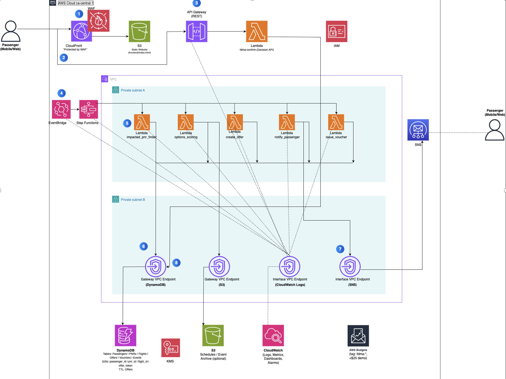
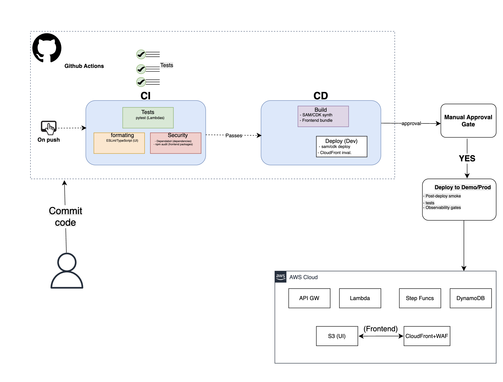

# Flight Disruption Management Agent (AWS-Native)

> **When a flight is delayed or canceled, this agent detects it, finds the best alternative flights, asks the passenger to confirm via a secure link, then rebooks (mock) or issues a voucher — end-to-end, with human fallback for edge cases.**

---

## 1. Why This Exists & Business Value

Airline irregular operations (IROPs) — weather, crew issues, ATC delays — create chaos:

* Long queues at airport counters
* Overloaded call centers
* Angry passengers with no clear options
* High costs for hotel/meal vouchers and reaccommodation

Most airlines still rely on **manual triage**. This project is an **AWS-native autonomous agent** that:

1. **Detects** significant delays/cancellations in near real time.
2. **Identifies** impacted passengers and their PNRs.
3. **Generates** best-fit rebooking options based on rules.
4. **Notifies** passengers via SMS/email.
5. **Executes** a mock rebooking or voucher issuance once the passenger confirms.
6. **Escalates** complex cases to a human queue.
7. **(Optional) AI Assist:** Amazon Bedrock summarizes disruptions and ranks options **after PII redaction**.

### Business Value

* **Faster Recovery**
* **Happier Passengers**
* **Lower Operating Cost**
* **Auditability & Data**

---

## 2. High-Level Architecture



Include callouts:

* **Security Notes – TODO**
* **Cost Notes – TODO**

---

## 3. AWS Services Used

* Amazon EventBridge
* AWS Step Functions
* AWS Lambda
* Amazon DynamoDB
* Amazon S3
* Amazon SNS / Pinpoint
* Amazon API Gateway
* Amazon CloudFront (optional)
* Amazon SQS (DLQs)
* Amazon CloudWatch
* AWS IAM / KMS
* Amazon Bedrock *(optional AI assist)*

---

## 4. Repository Structure

```
backend/
frontend/
docs/
```

---

## 5. Deployment

### Terraform (One Click)

```
terraform init
terraform plan
terraform apply -auto-approve
```

### GitHub Actions CI/CD

* OIDC → AWS Role
* Build frontend
* Deploy to S3
* Terraform plan/apply

---



---

## 7. Security Model

* Least privilege IAM
* KMS encryption
* Tokenized links
* No raw PII in logs
* Bedrock receives only **redacted** data

---

## 8. Cost Model

* Fully serverless for near-zero idle cost
* Log retention control
* DynamoDB on-demand
* Budgets & alerts

---

## 9. Flow Summary

1. EventBridge detects disruption
2. Step Functions orchestrates flow
3. Lambdas generate options
4. Passenger notified
5. Passenger decides
6. Voucher or rebooking completed
7. Events logged for audit
8. *(Optional) Bedrock summarizes disruption & ranks options*

---

## 9. How to Trigger a Demo Event

You can manually trigger a disruption event in **three ways**, depending on your environment and how you want to demonstrate the agent.

### **Method 1 — EventBridge Manual Trigger (Recommended for Demos)**

1. Go to **Amazon EventBridge** → *Events* → *Event buses* → `default`.
2. Click **Send events**.
3. Paste the following sample disruption event:

   ```json
   {
     "detail-type": "flight.status_changed",
     "source": "demo.flightfeed",
     "detail": {
       "flightId": "AB1234",
       "status": "CANCELLED",
       "scheduledDeparture": "2025-11-19T14:30:00Z",
       "scheduledArrival": "2025-11-19T16:00:00Z"
     }
   }
   ```
4. Press **Send**.

You should immediately see a new execution in **Step Functions**.

---

### **Method 2 — Lambda Invocation (Test Event)**

If your architecture includes a `simulate_disruption` Lambda:

1. Open **AWS Lambda**.
2. Select the simulation function.
3. Click **Test** and use this event:

   ```json
   {
     "flightId": "ZX900",
     "type": "CANCELLED"
   }
   ```
4. Run the test.

This triggers the same EventBridge rule.

---

### **Method 3 — CLI Trigger**

Run this command:

```bash
aws events put-events --entries '
  [{
    "Source": "demo.flightfeed",
    "DetailType": "flight.status_changed",
    "Detail": "{ \"flightId\": \"CD450\", \"status\": \"DELAYED_120\" }"
  }]'
```

You can script multiple disruptions for load testing.

---

## Executive Summary

The **Flight Disruption Management Agent** is a fully serverless, AWS-native system that automates one of the most operationally expensive airline processes: handling cancellations and major delays. The system ingests flight status changes in real time, identifies impacted passengers, generates ranked rebooking options, notifies customers via SMS/email, and completes a mock rebooking or compensation flow—end to end, without human intervention.

Built using **EventBridge, Step Functions, Lambda, DynamoDB, API Gateway, SNS/Pinpoint, S3, CloudFront**, and optional **Amazon Bedrock** for AI summarization, the architecture demonstrates real production patterns:

* Event-driven orchestration
* Stateless micro-compute
* Secure multi-table NoSQL modeling
* Token-based passenger workflows
* Human escalation queues
* Full auditability
* Low-cost, infinitely scalable design

This project is a production-style MVP showcasing strong cloud architecture, serverless engineering, automation design, and DevOps pipelines—all mapped to real airline business value.

---

## 10. Roadmap

* GDS integration
* Loyalty rules
* Multi-language messaging
* Advanced analytics

---

## 11. Credits

Flight Disruption Management Agent — Capstone Project